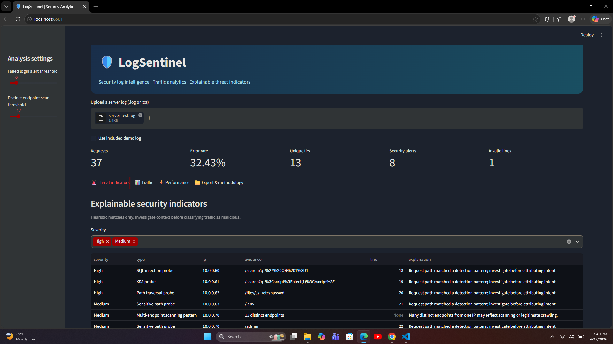
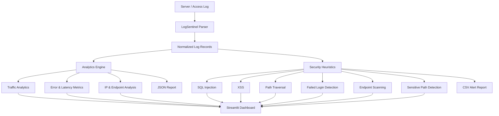

# 🛡️ LogSentinel — Security Log Analytics & Threat Detection

LogSentinel is a Python-based, explainable, rule-based cybersecurity log analytics dashboard. It analyzes custom access logs and Apache/Nginx combined access logs, visualizes HTTP activity, identifies suspicious activity indicators, and exports investigation reports.

> **Important:** Security matches are indicators for investigation, not proof that an attack occurred. The project uses deterministic heuristics; it is not a full SIEM, IDS, or automated blocking system.

## 📸 Dashboard Preview



## ✨ Features

- 📊 Streamlit dashboard for security and traffic analytics
- 📈 Request volume, HTTP status codes, methods, IPs, and endpoints
- 🚨 Explainable indicators for:
  - SQL injection probes
  - XSS probes
  - Path traversal probes
  - Sensitive path probes
  - Repeated failed authentication
  - Multi-endpoint scanning patterns
- ⚙️ Configurable failed-login and endpoint-scan thresholds
- ⚡ Per-endpoint average and maximum latency for custom logs
- 🕒 Timestamp-based per-minute traffic visualization for Apache/Nginx combined logs
- 📄 JSON summary report export
- 📋 CSV security-alert export
- 💻 Command-line analysis mode
- 🧪 Automated unit tests
- ⚠️ Malformed-line tracking
- 🧰 Synthetic test logs for demonstrations

## 🏗️ Architecture



## 🔄 How It Works

1. **Input** — Upload a `.log` or `.txt` server/access log.
2. **Parsing** — LogSentinel parses supported custom or Apache/Nginx combined records.
3. **Normalization** — Requests are converted into structured records containing fields such as method, path, status, latency, IP, and timestamp when available.
4. **Analytics** — The engine calculates request counts, error rates, IP activity, endpoint activity, and latency statistics.
5. **Threat heuristics** — Deterministic rules search for suspicious request patterns and repeated authentication/scan behavior.
6. **Visualization** — Streamlit presents the results through Traffic, Threat Indicators, Performance, and Export sections.
7. **Reporting** — Users can export JSON summaries and CSV security alerts.

## 🧰 Technologies Used

| Technology | Purpose |
|---|---|
| Python | Core application and analysis logic |
| Streamlit | Interactive web dashboard |
| Pandas | Data analysis and tabular processing |
| Regex | Suspicious-pattern matching |
| unittest | Automated testing |
| JSON | Summary report format |
| CSV | Security-alert report format |
| Git/GitHub | Version control and project hosting |

## 🧪 Testing

The project includes automated unit tests.

Run:

```powershell
python -m unittest discover -s tests -v
```

Current test suite:

```text
Ran 5 tests
OK
```

The included synthetic security test log can also be used to manually verify the dashboard.

Example dashboard verification:

| Metric | Expected with `server-test.log` |
|---|---:|
| Requests | 37 |
| Error rate | 32.43% |
| Unique IPs | 13 |
| Invalid lines | 1 |
| Security alerts | 8 |

The failed-login alert threshold is configurable. With the default threshold of 6, the supplied test file produces 8 alerts. Lowering the threshold can cause the repeated-login rule to trigger as well.

## 🚀 Demo / Quick Start

### Windows PowerShell

```powershell
cd LogSentinel
py -m venv .venv
.\.venv\Scripts\Activate.ps1
python -m pip install -r requirements.txt
python -m streamlit run app.py
```

If PowerShell blocks activation:

```powershell
.\.venv\Scripts\python.exe -m pip install -r requirements.txt
.\.venv\Scripts\python.exe -m streamlit run app.py
```

Open the local Streamlit URL shown in the terminal, normally:

```text
http://localhost:8501
```

### Test with the included sample

In the dashboard, choose the included demo log or upload:

```text
logs/server-test.log
```

Then inspect:

- **Threat indicators**
- **Traffic**
- **Performance**
- **Export & methodology**

## 💻 Command-Line Mode

```powershell
python cli.py logs/sample.log --json reports/summary.json --csv reports/alerts.csv
```

## 📁 Project Structure

```text
LogSentinel/
├── app.py
├── engine.py
├── cli.py
├── logs/
│   ├── sample.log
│   └── server-test.log
├── reports/
│   └── .gitkeep
├── screenshots/
│   └── dashboard.png
├── tests/
│   └── test_engine.py
├── requirements.txt
├── .gitignore
└── README.md
```

## 📄 Supported Log Formats

### Custom format

```text
POST /login 401 15 10.0.0.3
```

Format:

```text
METHOD PATH STATUS LATENCY_MS IP
```

### Apache/Nginx combined access logs

```text
127.0.0.1 - - [10/Oct/2000:13:55:36 -0700] "GET /index.html HTTP/1.0" 200 2326 "-" "Mozilla/5.0"
```

Other formats such as JSON, syslog, and CloudTrail are not supported in the current version.

## ⚠️ Limitations

- Security detections are heuristic indicators, not proof of malicious activity.
- Authentication and endpoint-scan thresholds aggregate over the uploaded file rather than using a time window.
- No machine learning, IP reputation lookup, geo-IP enrichment, live monitoring, or attack blocking is implemented.
- Combined Apache/Nginx logs do not provide request latency.
- Very large logs are not streamed in this version; the file is loaded into memory.
- Dashboard upload limit is 20 MB.
- Do not upload sensitive production logs to a public deployment.

## 👩‍💻 Resume Description

**LogSentinel | Python, Streamlit, Pandas, Cybersecurity**

Developed a security log analytics dashboard supporting custom and Apache/Nginx access logs. Implemented explainable detection rules for suspicious request patterns, authentication failures, sensitive-path probes and endpoint scanning; visualized traffic, error and latency trends; and exported JSON/CSV investigation reports.
